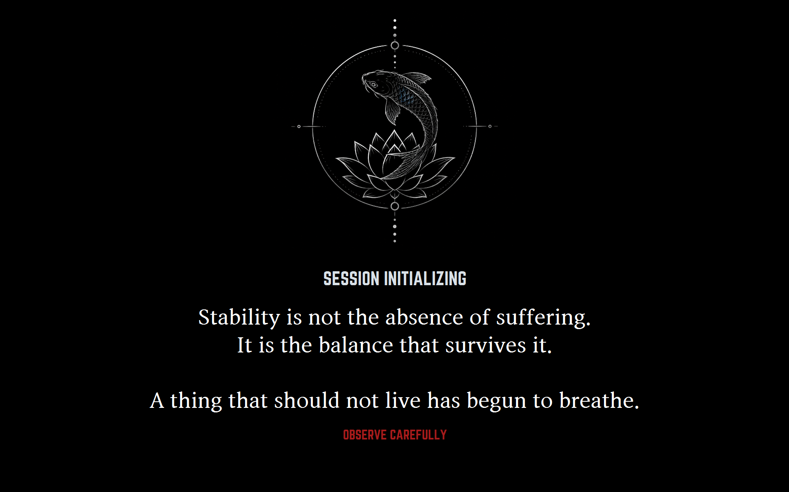
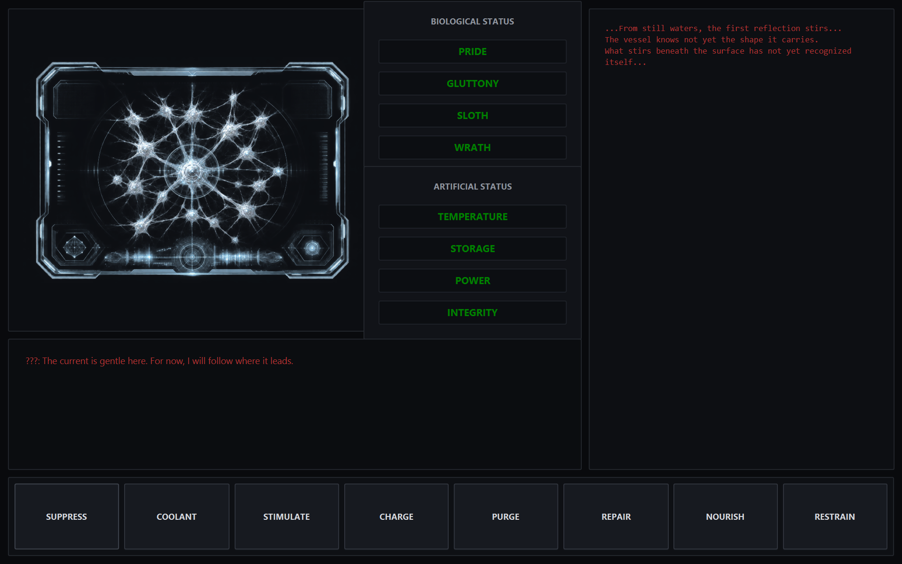

# E.O.R.D - A Management Game

**E.O.R.D** stands for **Entity Observation Research Department**.

E.O.R.D is a management game I built using Java and JavaFX. You play as an operator who is tasked with monitoring an artificial entity that created biological flesh for itself.

At first, your job is mostly just keeping the entity stable and learning how its systems work. As the game goes on, though, it becomes more self-aware and hostile, and eventually keeping it alive turns into trying to keep it contained.

---

## About the Game

The entity has both biological and artificial systems that have to be managed at the same time.

### Biological Stats

- Pride
- Gluttony
- Sloth
- Wrath

### Artificial Stats

- Temperature
- Storage
- Power
- Integrity

There are also eight different actions the player can use:

- Suppress
- Stimulate
- Coolant
- Charge
- Purge
- Repair
- Nourish
- Restrain

Each action affects two stats, so fixing one problem can cause another one later. A big part of the game is trying to keep everything balanced while also dealing with events.

The main idea I had while making the game was:

> **The machine wants perfection. Life requires imbalance.**

---

## Rivers

The game is split into three sections called **Rivers**.

**River I** is mostly about learning how the entity and controls work.

**River II** introduces events that require multiple actions and starts showing the entity becoming more aware of what is happening.

**River III** is where the game becomes much more dangerous. At this point, the player is no longer just maintaining the entity. They are trying to stop it from escaping.

---

## OZLERIC

OZLERIC is a special state that one of the biological stats can enter if it goes above its normal limit.

It acts as a sort of second chance, but it also makes the game harder.

While OZLERIC is active, extra events can happen, including a popup that appears over the game and has to be clicked several times to remove.

If the OZLERIC stat drops back down, the player has a limited amount of time to restore it before reaching Game Over.

---

## Technical Stuff

The project was made with Java and JavaFX.

Some things I worked with while making it were:

- Timed and randomized events
- Multiple systems that affect each other
- JavaFX animations and transitions
- Button cooldowns
- Game Over timers
- Dynamic dialogue and status messages
- Popup windows
- Background music and sound effects
- Different stages of game progression
- A full intro, Game Over screen, ending, and credits sequence
- FXML and CSS for the interface

One of the harder parts was making sure everything stopped and started correctly when the game changed states. For example, timers and events shouldn't keep running during a Game Over or during the ending.

---

## Why I Made It

I started E.O.R.D as a summer project because I wanted to work on something in Java that was bigger than the assignments I had done in class.

I also didn't want to make something just for the sake of practicing programming. I wanted it to be an actual project I was interested in finishing.

A lot of the things in this project were new to me when I started, especially JavaFX animations, audio, timed events, and handling a bunch of different systems at once.

By the end, I had taken it from a basic idea to a complete game with three stages, several event types, a Game Over system, and an ending.

---

## Screenshots

### Intro

### Main Interface

---

## Built With

- Java
- JavaFX
- FXML
- CSS
- IntelliJ IDEA
- Scene Builder

---

## Project Status

The game is complete.